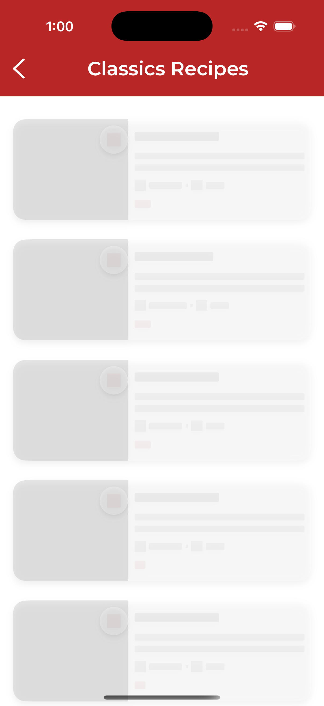

# QuickPrep

QuickPrep is a sleek and intuitive recipe application built using SwiftUI. It allows users to explore a wide variety of recipes, complete with pricing, nutritional information, preparation instructions, and a list of required ingredients. Users can save their favorite recipes, search for specific dishes, and enjoy a seamless experience powered by efficient architecture and responsive design.

## Features

- **Recipe Exploration**: Browse through a collection of curated recipes with detailed information.
- **Nutritional Info & Pricing**: View estimated prices and nutritional breakdowns per recipe.
- **Instructions & Ingredients**: Step-by-step cooking instructions and complete ingredient lists.
- **Recipe Video Tutorial**: A tutorial video for the recipe.
- **Favorites**: Save recipes to your personal favorites list for quick access later.
- **Search**: Search recipes by name quickly and easily.
- **Image Caching**: Smooth image loading and caching using SDWebImage for a better user experience.
- **Persistent Storage**: Core Data is used to save favorite recipes locally for offline access.
- **Modular & Scalable Architecture**: Designed using Clean Architecture with clear separation into Data, Domain, and Presentation layers.
- **MVVM Pattern**: Implements Model-View-ViewModel for organized and testable UI logic.
- **Coordinator Pattern**: Manages navigation flow in a modular and testable manner.
- **Dependency Injection**: Factory-based DI system improves flexibility and testability.
- **Unit Testing**: Core business logic and components are thoroughly tested for reliability.
- **Pagination**: Recipes are fetched in batches for optimized performance and reduced load time.
  
## Screenshots

|  |  |  |
| --- | --- | --- |
|  |  |  |
| --- | --- | --- |
|  |  |  |
| --- | --- | --- |
|  |  |  |
| --- | --- | --- |
|  | 

## Technologies Used

### Swift & SwiftUI
QuickPrep is developed in Swift and utilizes SwiftUI for building dynamic and adaptive UIs.

### Combine
Used for reactive programming, and data binding.

### Alamofire
Handles networking and API communication with clean abstractions.

### SDWebImage
Used for efficient downloading and caching of recipe images.

### Core Data
Local database for storing favorite recipes with offline access capability.

### Clean Architecture
The app is structured using the Clean Architecture approach with three layers:
- **Data Layer**: Handles networking and data persistence.
- **Domain Layer**: Contains business logic and use cases.
- **Presentation Layer**: Builds the UI with SwiftUI and manages interaction logic.

### MVVM (Model-View-ViewModel)
The MVVM pattern is used for separation of concerns and cleaner UI logic management.

### Coordinator Pattern
A flexible navigation system that separates flow logic from views.

### Dependency Injection
Factory-based DI promotes testability and modularity.

### Unit Testing
Critical components are covered with unit tests to ensure app stability.

## Installation

1. Clone the repository:
    ```sh
    git clone https://github.com/youssef-alaaeldin/quickprep.git
    ```
2. Navigate to the project directory:
    ```sh
    cd mealapp
    ```
3. Open the project in Xcode:
    ```sh
    open MealApp.xcodeproj
    ```
4. Install dependencies using CocoaPods or Swift Package Manager:
    ```sh
    pod install
    ```
5. Open the `.xcworkspace` file in Xcode:
    ```sh
    open MealApp.xcworkspace
    ```

## Usage

1. Build and run the application on a device or simulator (minimum iOS 16).
2. Browse through available recipes.
3. Use the search bar to find specific dishes.
4. View detailed recipe info including pricing, nutrition, ingredients, and instructions.
5. Tap the heart icon to save recipes to your favorites using Core Data.

## Contributing

We welcome contributions! Please fork the repo, open an issue, or submit a pull request with your improvements. Be sure to follow our coding style and include unit tests where necessary.

## License

This project is licensed under the MIT License. See the [LICENSE](LICENSE) file for details.

## Acknowledgements

- [Swift](https://swift.org/)
- [SwiftUI](https://developer.apple.com/xcode/swiftui/)
- [Combine](https://developer.apple.com/documentation/combine)
- [Alamofire](https://github.com/Alamofire/Alamofire)
- [SDWebImage](https://github.com/SDWebImage/SDWebImage)
- [Core Data](https://developer.apple.com/documentation/coredata)
- [Tasty API](https://rapidapi.com/apidojo/api/tasty/playground/apiendpoint_abf1bbc2-d08d-462b-b733-17392192ca46)

---
